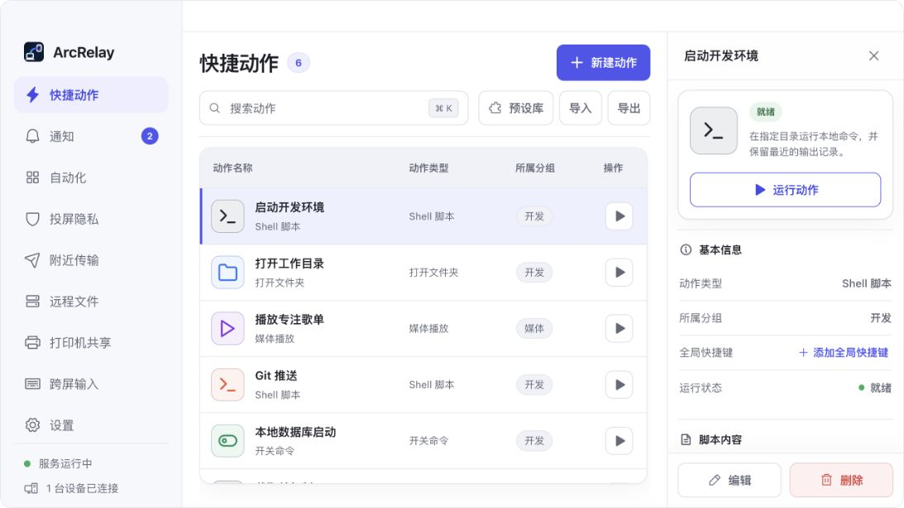
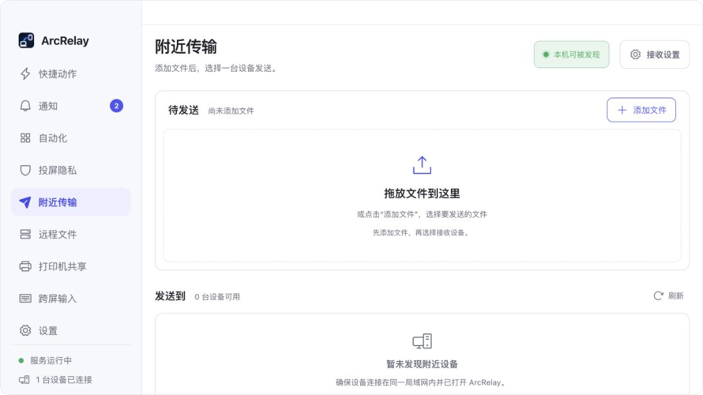
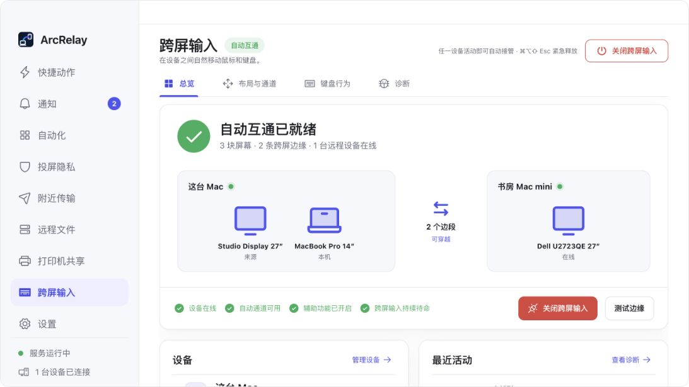

<p align="center"></p>

<h1 align="center">ArcRelay</h1>

<p align="center"><strong>すべてのデバイスを、ひとつの作業環境へ。</strong></p>

<p align="center">コンテンツ、入力、ファイル、印刷、定型操作をデバイス間で扱う、ローカルファーストのデスクトップワークスペースです。</p>

<p align="center">
  <a href="https://github.com/ArcRelayProject/arcrelay/actions/workflows/ci.yml"></a>
  <a href="https://github.com/ArcRelayProject/arcrelay/releases"></a>
  <a href="LICENSE"></a>
</p>

<p align="center">
  <a href="README.md">English</a> · <a href="README.zh-CN.md">简体中文</a> · 日本語 · <a href="README.ko.md">한국어</a> · <a href="README.de.md">Deutsch</a> · <a href="README.fr.md">Français</a> · <a href="README.es.md">Español</a> · <a href="README.pt-BR.md">Português</a>
</p>

<p align="center"></p>

> 画面は現在の ArcRelay デスクトップ版です。デバイス名と履歴には開発用サンプルデータを使用しています。

## 主な機能

ArcRelay は LAN 上のデバイスを検出し、認証済みの暗号化接続を確立します。デスクトップ間の連携にクラウドアカウントは不要で、利用者が許可した機能だけを相手へ公開します。

| | 機能 | 用途 |
| --- | --- | --- |
| ⚡ | クイックアクション | アプリ、フォルダー、スクリプト、よく使う操作を検索して実行。 |
| 🔁 | ローカル自動化 | トリガー、条件、確認、手順を組み合わせ、実行履歴を保存。 |
| 📋 | クリップボード | テキストや画像を検索して再利用。 |
| 📦 | 近距離転送 | 承認済みデバイスへファイルを直接かつ暗号化して送信。 |
| 📁 | リモートファイル | 許可された共有フォルダーを閲覧し、アップロードやダウンロードを実行。 |
| ⌨️ | デバイス間入力 | 画面を配置し、マウスとキーボードを複数の PC 間で移動。 |
| 🖨️ | プリンター共有 | ローカルプリンターを共有し、印刷ジョブを追跡。 |
| 🛡️ | プレゼンテーション保護 | 画面共有中に選択したアプリのウィンドウを隠す。 |

## スクリーンショット

<table><tr>
<td width="50%"></td>
<td width="50%"></td>
</tr><tr>
<td align="center"><strong>近距離転送</strong><br>進捗、整合性検証、受信制御を備えた直接転送。</td>
<td align="center"><strong>デバイス間入力</strong><br>画面、接続、診断を視覚的に管理。</td>
</tr></table>

## プライバシーと安全性

- QUIC と TLS 1.3 でデバイス間通信を保護します。
- デバイスの識別情報と機能ごとの許可をペアリング時に記録します。
- 更新パッケージは Tauri updater 鍵で署名され、インストール前に検証されます。
- 公式 macOS パッケージは Developer ID で署名され、Apple の公証を受けます。
- 脆弱性は [セキュリティポリシー](SECURITY.md) に従って非公開で報告できます。

## ダウンロードと更新チャンネル

| チャンネル | 対象 | 公開方法 |
| --- | --- | --- |
| **Stable** | 日常利用 | 管理者が `vMAJOR.MINOR.PATCH` タグを作成したときに公開。 |
| **Test** | 先行評価 | `main` の CI が成功するたびに自動公開。未完成の変更を含む場合があります。 |

**[GitHub Releases](https://github.com/ArcRelayProject/arcrelay/releases)** からダウンロードできます。現在の公式対象は Apple Silicon／Intel 版 macOS と x86-64／ARM64 版 Windows です。公式モバイルアプリは別途配布され、そのソースコードはこのリポジトリに含まれません。

**設定 → 一般 → 更新チャンネル** で Stable と Test を切り替えられます。両チャンネルは HTTPS マニフェストとアプリ内蔵の同じ公開鍵を使用し、テスト版の公開が Stable の配信先を変更することはありません。

## ソースから実行

Rust stable、Node.js 22、Tauri 2 のプラットフォーム依存パッケージが必要です。

```bash
git clone https://github.com/ArcRelayProject/arcrelay.git
cd arcrelay
npm ci
npm run tauri -- dev
```

このリポジトリには Tauri ホスト、Svelte UI、デスクトップ統合、リリース自動化が含まれます。Issue と範囲の明確な Pull Request を歓迎します。提出前に [CONTRIBUTING.md](CONTRIBUTING.md) をお読みください。

## ライセンスと商標

Copyright © 2026 Shenzhen Changning Technology Co., Ltd.

ソースコードは [GNU AGPL v3.0 only](LICENSE) で提供されます。ArcRelay の名称、ロゴ、ブランド資産については [TRADEMARKS.md](TRADEMARKS.md) を確認してください。
