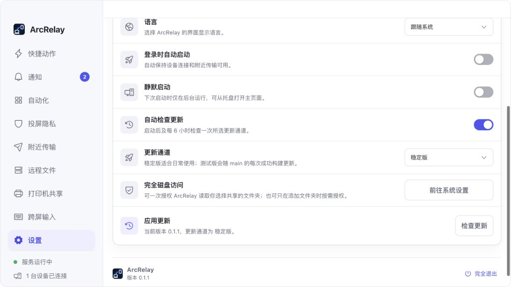

<p align="center">
  
</p>

<h1 align="center">ArcRelay</h1>

<p align="center"><strong>Your devices, working as one.</strong></p>

<p align="center">A local-first desktop workspace for moving content, input, files, print jobs, and repeatable actions across your devices.</p>

<p align="center">
  <a href="https://github.com/ArcRelayProject/arcrelay/actions/workflows/ci.yml"></a>
  <a href="https://github.com/ArcRelayProject/arcrelay/releases"></a>
  <a href="https://github.com/ArcRelayProject/arcrelay/releases"></a>
  <a href="https://github.com/ArcRelayProject/arcrelay/stargazers"></a>
  <a href="LICENSE"></a>
</p>

<p align="center">
  
  
</p>

<p align="center">
  English · <a href="README.zh-CN.md">简体中文</a> · <a href="README.ja.md">日本語</a> · <a href="README.ko.md">한국어</a> · <a href="README.de.md">Deutsch</a> · <a href="README.fr.md">Français</a> · <a href="README.es.md">Español</a> · <a href="README.pt-BR.md">Português</a>
</p>

<p align="center">
  <a href="#what-arcrelay-does">Features</a> · <a href="#screenshots">Screenshots</a> · <a href="#download">Download</a> · <a href="#updates-and-signing">Updates</a> · <a href="#build-from-source">Build</a>
</p>

<p align="center">
  
</p>

> The screenshots are captured from the current ArcRelay desktop frontend. Sample devices and activity are shown in development mode.

## What ArcRelay does

ArcRelay keeps everyday device collaboration close to the operating system and close to you. Devices discover each other on the local network, establish authenticated encrypted connections, and expose only the capabilities you approve. There is no cloud account requirement for the desktop collaboration path.

| | Capability | What it is for |
| --- | --- | --- |
| ⚡ | Quick actions | Launch apps, open folders, run scripts, and reuse common tasks from one searchable command surface. |
| 🔁 | Local automation | Combine triggers, conditions, confirmations, and ordered steps with a durable activity history. |
| 📋 | Clipboard workspace | Search and reuse clipboard content, including structured text and image previews. |
| 📦 | Nearby transfer | Send files directly to approved devices with progress, integrity checks, and receive policies. |
| 📁 | Remote files | Browse approved shared folders and upload, download, rename, or preview remote content. |
| ⌨️ | Cross-screen input | Arrange displays and move the pointer and keyboard naturally between connected computers. |
| 🖨️ | Printer sharing | Publish local printers and track remote print jobs from the desktop. |
| 🛡️ | Presentation privacy | Mask selected application windows while presenting or mirroring a display. |
| 🤖 | Local agent access | Let compatible local tools use selected ArcRelay actions through an explicit MCP permission model. |

ArcRelay is local-first rather than offline-only. Features that cross devices still need a reachable LAN, routed private network, or VPN.

## Screenshots

<table>
  <tr>
    <td width="50%"></td>
    <td width="50%"></td>
  </tr>
  <tr>
    <td align="center"><strong>Nearby transfer</strong><br>Direct, encrypted file delivery with clear receive controls.</td>
    <td align="center"><strong>Cross-screen input</strong><br>A visual workspace for displays, edges, connections, and diagnostics.</td>
  </tr>
</table>

## Privacy and security

- QUIC with TLS 1.3 protects device connections in transit.
- Pairing records device identity and capability grants instead of granting every feature at once.
- Shared folders, remote input, printing, and agent access each have separate controls.
- Update packages are signed with the Tauri updater key before publication.
- Official macOS packages use a Developer ID Application signature and Apple notarization.
- Security reports can be submitted privately through the [security policy](SECURITY.md).

## Download

| Channel | Audience | Delivery |
| --- | --- | --- |
| **Stable** | Daily use | Published from a maintainer-created `vMAJOR.MINOR.PATCH` tag and marked as the latest GitHub release. |
| **Test** | Early testing | Published automatically after every successful `main` CI run. It may contain unfinished changes. |

Download available packages from **[GitHub Releases](https://github.com/ArcRelayProject/arcrelay/releases)**. Current official targets are macOS on Apple Silicon and Intel (`.dmg`), plus Windows on x86-64 and ARM64 (`-setup.exe`). Linux packaging will follow when the native process and system-monitor services are available on Linux.

The official ArcRelay mobile application is distributed separately. Its source code is not part of this repository.

## Updates and signing

Open **Settings → General → Update Channel** to choose Stable or Test. ArcRelay checks the selected channel after launch and every six hours when automatic checks are enabled. You can also check manually, review the offered version, and install it from the same page.

Both channels use HTTPS manifests and the same embedded public key. The app verifies the downloaded package signature before installation. Stable builds consume the latest non-prerelease manifest; Test builds consume a separately maintained Test manifest. ArcRelay reserves a numeric patch range for Test packages so macOS and Windows accept the version metadata, and recognizes that range when you switch back to Stable.

<p align="center"></p>

## Quick start

1. Install ArcRelay on each computer you want to connect.
2. Open **Settings → Connection** and give each device a recognizable name.
3. Add a nearby device, compare the pairing code, and approve only the requested capabilities.
4. Open Nearby Transfer, Remote Files, Printer Sharing, or Cross-screen Input from the sidebar.

Operating-system permissions are requested only when the corresponding feature needs them. macOS may ask for Accessibility, Screen Recording, or Full Disk Access depending on the capabilities you enable.

## Build from source

Requirements: Rust stable, Node.js 22, and the platform development dependencies required by Tauri 2.

```bash
git clone https://github.com/ArcRelayProject/arcrelay.git
cd arcrelay
npm ci
npm run tauri -- dev
```

Run the normal checks before submitting a change:

```bash
cargo fmt --all -- --check
cargo clippy --all-targets -- -D warnings
cargo test --all-targets
npm run check
npm test
npm run version:check
```

Official builds include an optional proprietary screenshot/OCR sidecar. Community builds work without it. Maintainers supply official sidecars through `SNIPTRA_ARTIFACT_DIR` and build with `npm run bundle:official`.

## Project structure

This repository contains the Tauri host, Svelte interface, native desktop integrations, and desktop release automation. Shared protocol and domain crates live under the [ArcRelayProject organization](https://github.com/ArcRelayProject) and are pinned to reviewed commits. The public workspace manifest is maintained separately in [`arcrelay-workspace`](https://github.com/ArcRelayProject/arcrelay-workspace).

Portable quick actions use the JSON format documented in [Action Text Format](docs/action-text-format.md).

## Contributing

Issues and focused pull requests are welcome. Read [CONTRIBUTING.md](CONTRIBUTING.md) before submitting code. Contributions require the appropriate individual or corporate CLA so the company can continue to distribute and commercially support the product.

## License and trademarks

Copyright © 2026 Shenzhen Changning Technology Co., Ltd.

The source code is licensed under [GNU AGPL v3.0 only](LICENSE). The ArcRelay name, logo, and other brand assets are handled separately; see [TRADEMARKS.md](TRADEMARKS.md) before distributing a modified build under ArcRelay branding.

## Embedded Sniptra screenshots

Official stable and Test installers include the closed-source Sniptra screenshot
component from [binary releases](https://github.com/ArcRelayProject/sniptra-releases).
The release preparation job resolves protocol 1 once, then every platform downloads
the same release using the locked archive SHA-256. File checksums, executable
metadata and OCR startup must pass before packaging. Missing components fail the
release. `sniptra-lock.json` is retained with release assets for reproduction.

Set the workflow dispatch `sniptra_release` input (or repository variable
`SNIPTRA_RELEASE_TAG`) to the recorded release tag to rebuild an exact dependency.
macOS uses universal Intel/Apple Silicon components; Windows x86_64 uses native
binaries. Windows 11 ARM64 uses x64 emulation and validates both executable
protocols on the ARM64 runner; there is no native ARM64 Sniptra artifact.

Community source builds can omit Sniptra. To embed an official component, run
`node scripts/sniptra-release.mjs resolve sniptra-lock.json`, then
`node scripts/sniptra-release.mjs download sniptra-lock.json TARGET`; outside
GitHub Actions set `SNIPTRA_ARTIFACT_DIR` to the printed component directory and
`SNIPTRA_SIDECAR_TARGET` to the Rust target. Invoke `sniptra one-shot capture` and
isolate settings with `SNIPTRA_PROFILE_DIR`. Redistribution terms are bundled in
`sniptra-notices`; do not include private Sniptra sources.
